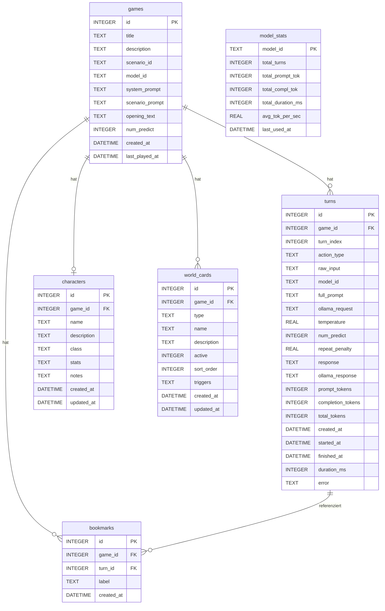

# Datenbankmodell — StoryTelling

Dieses Dokument beschreibt das aktuelle SQLite-Schema. **Bei jeder Schemaänderung muss dieses Dokument sofort aktualisiert werden** (siehe CLAUDE.md).

## Felder (Erläuterungen)

### games
| Feld | Beschreibung |
|---|---|
| `system_prompt` | Globaler DM-Prompt (Schreibstil, allg. Regeln), editierbar im Plot-Tab |
| `scenario_prompt` | Szenario-spezifischer DM-Prompt (Weltbeschreibung, Szenario-Regeln), editierbar im Scenario-Tab |
| `opening_text` | Eröffnungstext der Story (wird als erstes Narrativ angezeigt) |
| `num_predict` | Per-Game Output-Token-Limit (25–200, Standard: 150), editierbar im Model-Tab |

### turns
| Feld | Beschreibung |
|---|---|
| `action_type` | `do` / `say` / `story` / `continue` |
| `full_prompt` | JSON der an Ollama gesendeten messages |
| `ollama_request` | Vollständiger Ollama-Request-Body |

### world_cards
| Feld | Beschreibung |
|---|---|
| `type` | `location` / `npc` / `item` / `faction` / `lore` |
| `active` | 0 = inaktiv (nicht in Kontext injiziert) |
| `triggers` | Kommagetrennte Schlüsselwörter; leer = immer injiziert (pinned); gesetzt = nur injiziert wenn ein Keyword im aktuellen Spielerzug oder den letzten 2 Nachrichten vorkommt |
