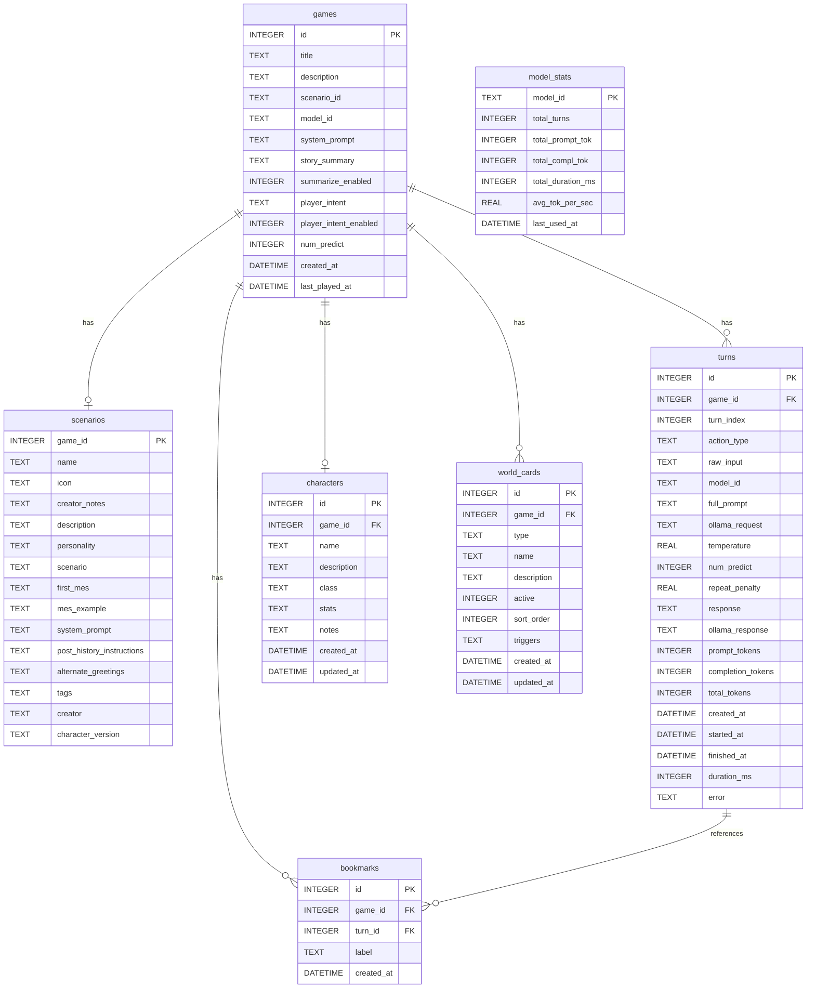

# Database Model — StoryTelling

Current SQLite schema. **Update this document immediately after any schema change** (see CLAUDE.md).

## Field notes

### games

| Field | Description |
|---|---|
| `system_prompt` | Merged global narrator prompt (writing style, general rules) — editable in the Plot tab. The former `custom_prompt` was folded into this field. |
| `story_summary` | Running summary of turns that have been trimmed from the context window |
| `summarize_enabled` | 1 = auto-summarize trimmed turns into `story_summary` (default), 0 = off — editable via the switch in the Model tab |
| `player_intent` | Generated narrator instruction from analyzing all player inputs (what the player wants) — injected into the system prompt |
| `player_intent_enabled` | 1 = auto-analyze player intent every `playerIntentAfterMessages` inputs (default), 0 = off — editable via the switch in the Model tab |
| `num_predict` | Per-game output token limit (25–200, default: 150) — editable in the Model tab |

### scenarios

Columns mirror the [Character Card V2 spec](https://github.com/malfoyslastname/character-card-spec-v2/blob/main/spec_v2.md) (`data.*` fields).

| Field | Description |
|---|---|
| `game_id` | PK and FK to games — enforces 1:1 relationship |
| `name` | Card name shown in the UI — the value of the `{{char}}` macro |
| `icon` | Emoji icon (app extension; in card files: `extensions.storytelling.icon`) |
| `creator_notes` | One-line UI pitch — never included in the prompt (was old `description`) |
| `description` | Main card content — injected into every prompt after the system prompts; editable in the Scenario tab |
| `personality` | Short personality summary, injected as `{{char}}'s personality: …` when set |
| `scenario` | Circumstances of the story, injected as `Scenario: …` when set |
| `first_mes` | Opening narrative seeded as the first assistant message (was `opening_text`); editable + swappable against alternate greetings while the game is fresh |
| `mes_example` | Example dialogue, injected as `Example dialogue:` when set |
| `system_prompt` | Scenario system prompt (world rules, was `scenario_prompt`) — appended AFTER the global system prompt |
| `post_history_instructions` | Injected as a system message AFTER the chat history — always the last prompt part |
| `alternate_greetings` | JSON array of alternative `first_mes` values — dropdown on fresh games, editable in the Scenario tab |
| `tags` | JSON array of strings |
| `creator` / `character_version` | Card provenance metadata |

### turns

| Field | Description |
|---|---|
| `action_type` | `do` / `say` / `story` / `continue` |
| `full_prompt` | JSON array of messages sent to Ollama |
| `ollama_request` | Full Ollama request body |

### world\_cards

| Field | Description |
|---|---|
| `type` | `location` / `npc` / `item` / `faction` / `lore` |
| `active` | 0 = inactive (not injected into context) |
| `triggers` | Comma-separated keywords; empty = always injected (pinned); set = only injected when a keyword appears in the current player action or the last 2 messages |
