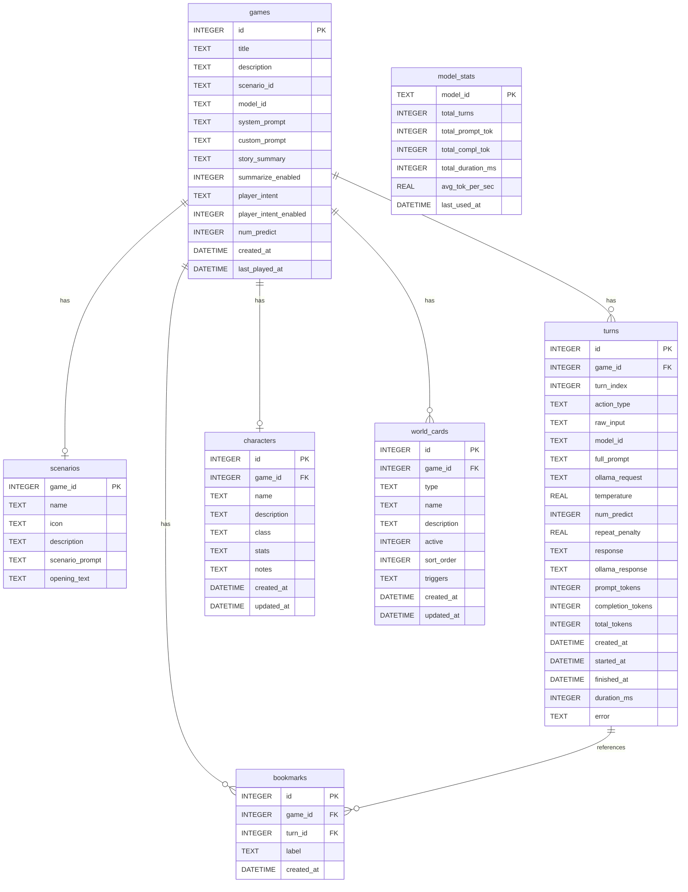

# Database Model — StoryTelling

Current SQLite schema. **Update this document immediately after any schema change** (see CLAUDE.md).

## Field notes

### games

| Field | Description |
|---|---|
| `system_prompt` | Global narrator prompt (writing style, general rules) — editable in the Plot tab |
| `custom_prompt` | Additional writing style / narrative rules appended after system_prompt |
| `story_summary` | Running summary of turns that have been trimmed from the context window |
| `summarize_enabled` | 1 = auto-summarize trimmed turns into `story_summary` (default), 0 = off — editable via the switch in the Model tab |
| `player_intent` | Generated narrator instruction from analyzing all player inputs (what the player wants) — injected into the system prompt |
| `player_intent_enabled` | 1 = auto-analyze player intent every `playerIntentAfterMessages` inputs (default), 0 = off — editable via the switch in the Model tab |
| `num_predict` | Per-game output token limit (25–200, default: 150) — editable in the Model tab |

### scenarios

| Field | Description |
|---|---|
| `game_id` | PK and FK to games — enforces 1:1 relationship |
| `name` | Display name shown in the UI (e.g. "Dungeons & Dragons") |
| `icon` | Emoji icon displayed on the scenario card and game header |
| `description` | One-line pitch on the scenario card |
| `scenario_prompt` | Scenario-specific narrator prompt (world setting, scenario rules) — moved from games, editable in the Scenario tab |
| `opening_text` | Opening narrative shown as the first story segment — moved from games |

### turns

| Field | Description |
|---|---|
| `action_type` | `do` / `say` / `story` / `continue` |
| `full_prompt` | JSON array of messages sent to Ollama |
| `ollama_request` | Full Ollama request body |

### world\_cards

| Field | Description |
|---|---|
| `type` | `location` / `npc` / `item` / `faction` / `lore` |
| `active` | 0 = inactive (not injected into context) |
| `triggers` | Comma-separated keywords; empty = always injected (pinned); set = only injected when a keyword appears in the current player action or the last 2 messages |
