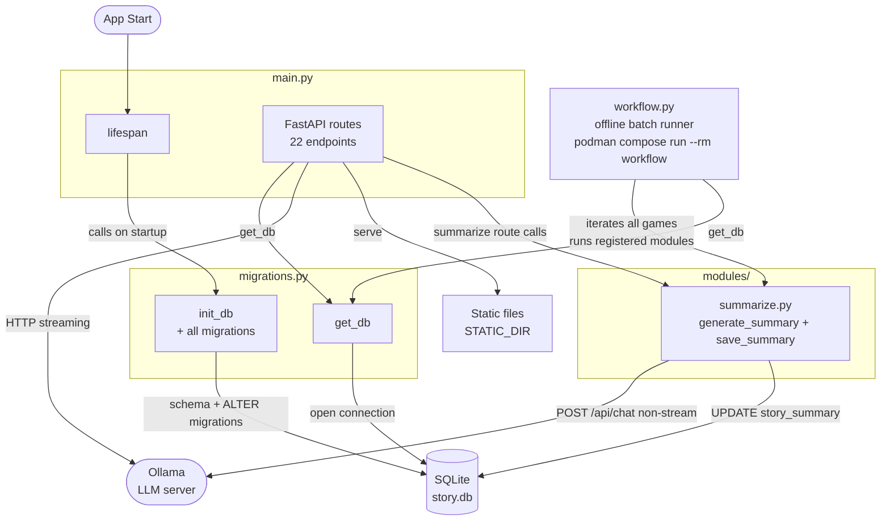

# Backend — Architecture Overview

> Click a module node to open its detailed diagram.

**Diagrams:**

- [migrations.py detail](flowDiagram_migrations.md)
- [main.py detail](flowDiagram_main.md)

**Modules:**

- `modules/summarize.py` — summarization business logic (no FastAPI code): `generate_summary` condenses story messages through Ollama, `save_summary` writes `games.story_summary`. Called by the `POST /api/games/{id}/summarize` route in `main.py` (live mode, only when the per-game `summarize_enabled` switch is on) and by `workflow.py` (offline mode).
- `workflow.py` — offline workflow engine for low-power systems (`podman compose run --rm workflow`): iterates all games and runs every job registered in its `MODULES` list. The summarize job regenerates each game's summary from scratch in chunks of `summarizeAfterMessages` (config.json); games still fitting the context window are skipped. Future batch jobs: add `modules/<name>.py` + a runner registered in `MODULES`.
