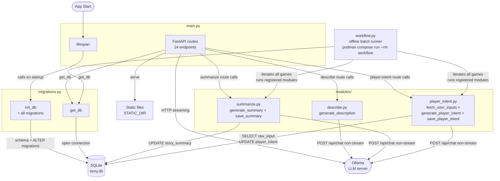

# Backend — Architecture Overview

> Click a module node to open its detailed diagram.

**Diagrams:**

- [migrations.py detail](flowDiagram_migrations.md)
- [main.py detail](flowDiagram_main.md)

**Modules:**

- `modules/summarize.py` — summarization business logic (no FastAPI code): `generate_summary` condenses story messages through Ollama, `save_summary` writes `games.story_summary`. Called by the `POST /api/games/{id}/summarize` route in `main.py` (live mode, only when the per-game `summarize_enabled` switch is on) and by `workflow.py` (offline mode).
- `modules/player_intent.py` — player intent analysis business logic (no FastAPI code): `fetch_user_inputs` reads all `raw_input` values of a game from the `turns` table, `generate_player_intent` asks Ollama what the player wants (prompt: `playerIntentPrompt` in config.json), `save_player_intent` writes `games.player_intent`. Called by the `POST /api/games/{id}/player-intent` route in `main.py` (triggered by the frontend every `playerIntentAfterMessages` player inputs when the per-game `player_intent_enabled` switch is on) and by `workflow.py` (offline mode).
- `modules/describe.py` — scene description business logic (no FastAPI code): `generate_description` asks Ollama for a detailed visual snapshot of the current scene (characters without names, clothing, poses, setting, lighting) for text-to-image models; prompt: `describePrompt` in config.json. Called by the `POST /api/games/{id}/describe` route in `main.py` (Describe button next to Continue). The result is ephemeral — nothing is stored.
- `workflow.py` — offline workflow engine for low-power systems (`podman compose run --rm workflow`): iterates all games and runs every job registered in its `MODULES` list. The summarize job regenerates each game's summary from scratch in chunks of `summarizeAfterMessages` (config.json); games still fitting the context window are skipped. Future batch jobs: add `modules/<name>.py` + a runner registered in `MODULES`.
