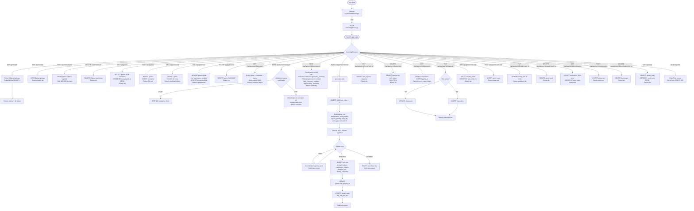

# Flow Diagram — main.py

> [Back to overview](flowDiagram.md)

```mermaid
flowchart TD
    START([App Start]) --> LF[lifespan\nasynccontextmanager]
    LF -->|calls| INIT[init_db\nfrom migrations.py]
    INIT --> APP([FastAPI app ready])
    APP --> E{Incoming Request}

    %% Health
    E -->|GET /api/health| F1[Probe Ollama /api/tags\nProbe SQLite SELECT 1]
    F1 --> F2[Return ollama + db status]

    %% Models
    E -->|GET /api/models| G1[GET Ollama /api/tags\nReturn model list]
    E -->|POST /api/models/pull| G2[Stream POST Ollama /api/pull\nYield NDJSON to client]
    E -->|DELETE /api/models/:id| G3[DELETE Ollama /api/delete\nReturn ok]

    %% Games
    E -->|GET /api/games| H1[SELECT games JOIN scenarios\nORDER BY last_played_at DESC\nReturn list]
    E -->|POST /api/games| H2[INSERT games\nINSERT scenarios\nReturn full row]
    E -->|GET /api/games/:id| H3[SELECT game\nSELECT all turns\nReturn combined object]
    E -->|PUT /api/games/:id| H4[UPDATE games fields\nincl. summarize_enabled\nUPSERT scenarios fields\nReturn updated row]
    E -->|DELETE /api/games/:id| H5[DELETE game CASCADE\nReturn ok]

    %% Scenario export / import
    E -->|GET /api/games/:id/scenario| I1[Query game + character + cards\nBuild export JSON\nReturn scenario object]
    E -->|POST /api/scenarios/import| I2{Validate id, name\ncard types}
    I2 -->|Invalid| I3[HTTP 400 Validation Error]
    I2 -->|Valid| I4[Write id.json to scenarios dir\nUpdate index.json\nReturn scenario]

    %% Summarize (business logic in modules/summarize.py)
    E -->|POST /api/games/:id/summarize| J1[Fetch game or 404\ncall modules/summarize.generate_summary\nOllama /api/chat non-stream\nsave_summary updates games.story_summary\nReturn summary]

    %% Turns — generate
    E -->|POST /api/games/:id/turns| K[generate_turn]
    K --> K1[SELECT MAX turn_index + 1]
    K1 --> K2[Build ollama_req\ntemperature, num_predict,\nrepeat_penalty, num_ctx, num_gpu, num_batch]
    K2 --> K3[Stream POST Ollama /api/chat]
    K3 --> K4{Stream loop}
    K4 -->|token| K5[Accumulate response_text\nYield token event]
    K5 --> K4
    K4 -->|done=true| K6[INSERT turn row\nprompt_tokens, completion_tokens,\nduration_ms, ollama_response]
    K6 --> K7[UPDATE games.last_played_at]
    K7 --> K8[UPSERT model_stats\navg_tok_per_sec]
    K8 --> K9[Yield done event]
    K4 -->|exception| K10[INSERT error turn row\nYield error event]

    %% Turns — edit / undo
    E -->|PUT /api/games/:id/turns/:turn_id| L1[UPDATE raw_input or response\nReturn ok]
    E -->|DELETE /api/games/:id/turns/last| L2[SELECT last turn by turn_index\nDELETE it\nReturn ok]

    %% Characters
    E -->|GET /api/games/:id/character| N1[SELECT characters WHERE game_id\nReturn row or empty object]
    E -->|PUT /api/games/:id/character| N2{Row exists?}
    N2 -->|Yes| N3[UPDATE characters]
    N2 -->|No| N4[INSERT characters]
    N3 & N4 --> N5[Return character row]

    %% World Cards
    E -->|GET /api/games/:id/cards| O1[SELECT world_cards\nORDER BY sort_order, id\nReturn list]
    E -->|POST /api/games/:id/cards| O2[INSERT world_card\nReturn new row]
    E -->|PUT /api/games/:id/cards/:card_id| O3[UPDATE world_card all fields\nReturn updated row]
    E -->|DELETE /api/games/:id/cards/:card_id| O4[DELETE world_card\nReturn ok]

    %% Bookmarks
    E -->|GET /api/games/:id/bookmarks| P1[SELECT bookmarks JOIN turns\nORDER BY turn_index\nReturn list]
    E -->|POST /api/games/:id/bookmarks| P2[INSERT bookmark\nReturn new row]
    E -->|DELETE /api/games/:id/bookmarks/:bm_id| P3[DELETE bookmark\nReturn ok]

    %% Stats
    E -->|GET /api/stats| Q1[SELECT model_stats\nORDER BY total_turns DESC\nReturn list]

    %% Static fallback
    E -->|All other paths| R1[StaticFiles mount\nServe from STATIC_DIR]
```
