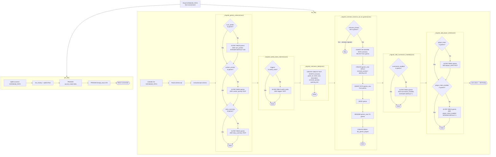

# Flow Diagram — migrations.py

> [Back to overview](flowDiagram.md)

```mermaid
flowchart TD
    ENV[Read DATABASE_PATH\nfrom environment]

    subgraph GET_DB["get_db()"]
        G1[sqlite3.connect DATABASE_PATH]
        G2[row_factory = sqlite3.Row]
        G3[PRAGMA journal_mode=WAL]
        G4[PRAGMA foreign_keys=ON]
        G1 --> G2 --> G3 --> G4
        G4 --> G5([Return connection])
    end

    subgraph INIT_DB["init_db()"]
        I1[makedirs for DATABASE_PATH]
        I1 --> I2[Read schema.sql]
        I2 --> I3[executescript schema]
        I3 --> M1

        subgraph M1["_migrate_games_columns(conn)"]
            MA1{num_predict\nin games?}
            MA1 -->|No| MA2[ALTER TABLE games\nADD num_predict INTEGER DEFAULT 150]
            MA1 -->|Yes| MA3
            MA2 --> MA3{custom_prompt\nin games?}
            MA3 -->|No| MA4[ALTER TABLE games\nADD custom_prompt TEXT]
            MA3 -->|Yes| MA5
            MA4 --> MA5{story_summary\nin games?}
            MA5 -->|No| MA6[ALTER TABLE games\nADD story_summary TEXT]
            MA5 -->|Yes| MA7([Done])
            MA6 --> MA7
        end

        M1 --> M2

        subgraph M2["_migrate_world_cards_columns(conn)"]
            MB1{triggers\nin world_cards?}
            MB1 -->|No| MB2[ALTER TABLE world_cards\nADD triggers TEXT]
            MB1 -->|Yes| MB3([Done])
            MB2 --> MB3
        end

        M2 --> M3

        subgraph M3["_migrate_scenarios_table(conn)"]
            MC1[CREATE TABLE IF NOT EXISTS scenarios\ngame_id, name, icon, description,\nscenario_prompt, opening_text]
            MC1 --> MC2([Done])
        end

        M3 --> M4

        subgraph M4["_migrate_scenario_columns_out_of_games(conn)"]
            MD1{scenario_prompt\nstill in games?}
            MD1 -->|No — already migrated| MD2([Skip])
            MD1 -->|Yes| MD3[INSERT OR IGNORE INTO scenarios\nSELECT from games]
            MD3 --> MD4[CREATE games_new without\nscenario_prompt / opening_text]
            MD4 --> MD5[INSERT INTO games_new\nfrom games]
            MD5 --> MD6[DROP games]
            MD6 --> MD7[RENAME games_new TO games]
            MD7 --> MD8[CREATE INDEX idx_games_played]
            MD8 --> MD9([Done])
        end

        M4 --> M5

        subgraph M5["_migrate_add_summarize_enabled(conn)"]
            ME1{summarize_enabled\nin games?}
            ME1 -->|No| ME2[ALTER TABLE games\nADD summarize_enabled INTEGER DEFAULT 1]
            ME1 -->|Yes| ME3([Done])
            ME2 --> ME3
        end

        M5 --> M6

        subgraph M6["_migrate_add_player_intent(conn)"]
            MF1{player_intent\nin games?}
            MF1 -->|No| MF2[ALTER TABLE games\nADD player_intent TEXT]
            MF1 -->|Yes| MF3
            MF2 --> MF3{player_intent_enabled\nin games?}
            MF3 -->|No| MF4[ALTER TABLE games\nADD player_intent_enabled INTEGER DEFAULT 1]
            MF3 -->|Yes| MF5([Done])
            MF4 --> MF5
        end

        M6 --> DONE([conn.close — DB Ready])
    end

    ENV --> GET_DB
    ENV --> INIT_DB
```
